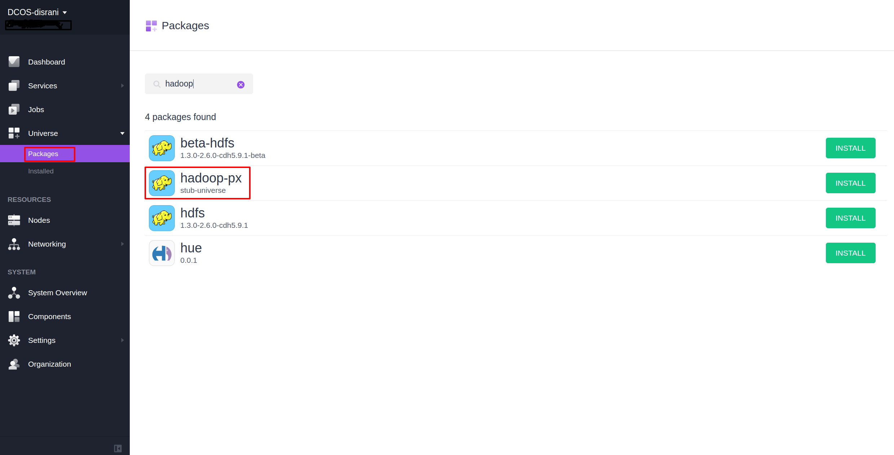
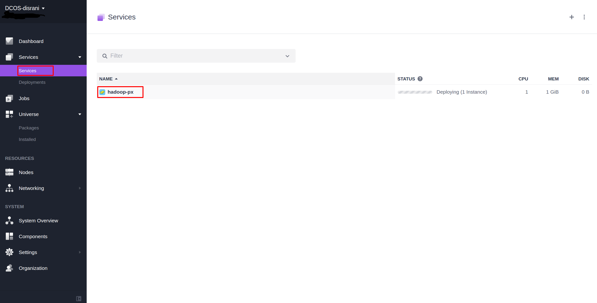
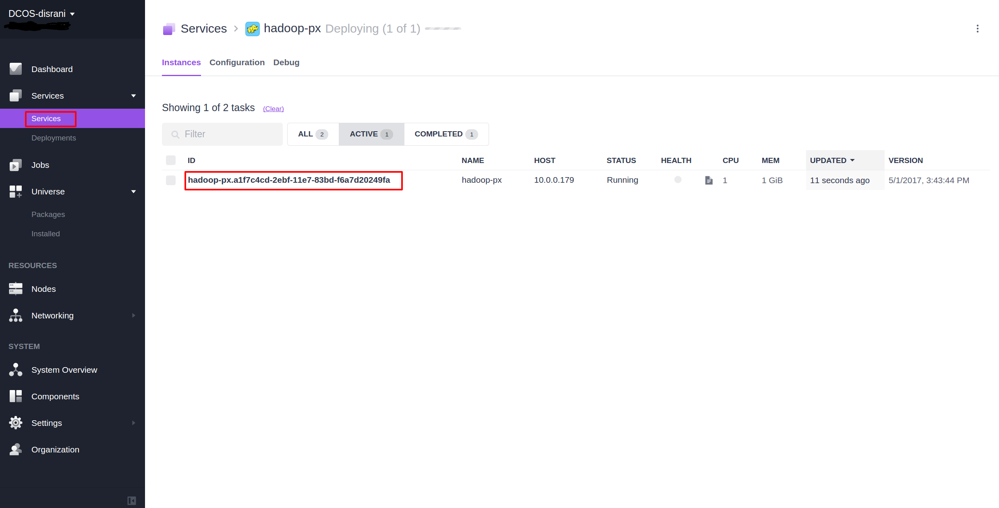
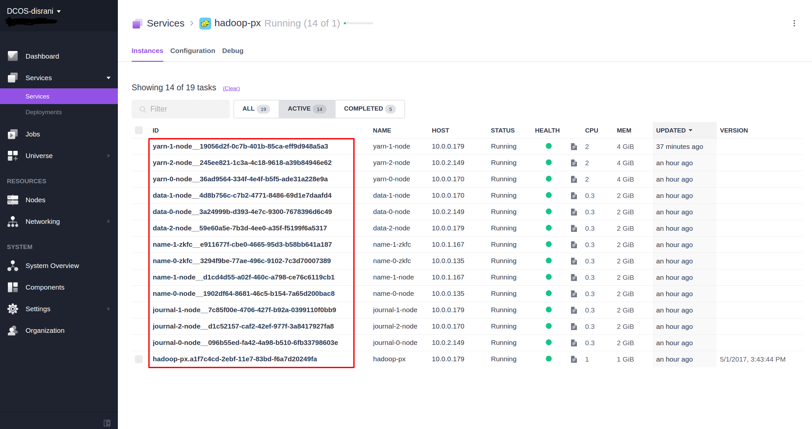

TODO: Will generate cleaner links in S3
TODO: Will see if it’s possible to add one repo with all the services available from there

This guide will help you to install the Hadoop service on your DCOS cluster backed by PX volumes for persistent storage.
It will create 2 Journal Nodes, 2 Name Nodes, 2 Nodes for the Zookeeper Failover Controller, 3 Data Nodes and 3 Yarn Nodes.
The Data and Yarn nodes will be co-located on the same physical host.

Since the stateful services in DCOS universe do not have support for external volumes, you will need to add additional
repositories to your DCOS cluster to install the services mentioned here. 

The source code for these services can be found here: https://github.com/portworx/dcos-commons

## Adding the repository for the service:

For this step you will need to login to a node which has the dcos cli installed and is authenticated to your DCOS cluster.

Run the following command to add the repository to your DCOS cluster:

```
$ dcos package repo add --index=0 hdfs-aws https://disrani-cassandra.s3.amazonaws.com/autodelete7d/hdfs/20170430-122331-NmBRyMXX9HZ86H0H/stub-universe-hdfs.zip
```

Once you have run the above command you should see the Hadoop-PX service available in your universe

{:width="655px" height="200px"}

## Installation
### Default Install
If you want to use the defaults, you can now run the dcos command to install the service
```
$ dcos package install --yes hadoop-px
```
You can also click on the  “Install” button on the WebUI next to the service and then click “Install Package”.

### Advanced Install
If you want to modify the default, click on the “Install” button next to the package on the DCOS UI and then click on
“Advanced Installation”

Here you have the option to change the service name, volume name, volume size, and provide any additional options that you
want to pass to the docker volume driver. You can also configure other Hadoop related parameters on this page including
the number of Data and Yarn nodes for the Hadoop clsuter.

Click on “Review and Install” and then “Install” to start the installation of the service.

## Install Status
Once you have started the install you can go to the Services page to monitor the status of the installation.

{:width="655px" height="200px"}

If you click on the Hadoop-PX service you should be able to look at the status of the nodes being created. There will be
one service for the scheduler and one each for the Journal, Name, Zookeeper, Data and Yarn nodes. 

{:width="655px" height="200px"}

When the Scheduler
service as well as all the Hadoop containers nodes are in Running (green) status, you should be ready to start using the
Hadoop cluster.

{:width="655px" height="200px"}

If you check your Portworx cluster, you should see multiple volumes that were automatically created using the options
provided during install, one for each of the Journal, Name and Data nodes.

{:width="655px"}

TODO: Add dcos cli command to check status of service

## Scaling the Data Nodes
You do not need to create additional volumes of perform to scale up your cluster. 
Just go to the Hadoop service page, click on the three dots on the top right corner of the page, select “Data”, scroll
down and increase the nodes parameter to the desired nodes.

Click on “Review and Run” and then “Run Service”. The service scheduler should restart with the updated node count and
create more Data nodes. Please make sure you have enough resources and nodes available to scale up the number of nodes.
You also need to make sure Portworx is installed on all the agents in the DCOS cluster.

You can also increase the capacity of your HDFS Data nodes by using the `pxctl volume update` command without taking the
service offline
